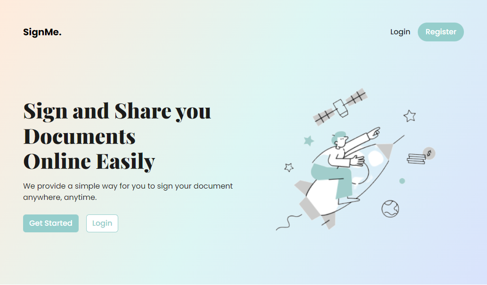

# SignMe App

App for document signing, user will be able to create an account, upload document, assign signers, check sign request, sign document, and download signed document.

## Anggota
- Rakhilca Yanedika (2111522005)
- Annisa Gita Subhi (2111522011)
- Syakina Triyana (2111522017)

## Models

### User Model

-   id: int
-   fullname: string
-   username: string (unique)
-   email: string email (unique)
-   instance string
-   password: string
-   signature: string (image url)
-   timestamps [created_at, updated_at]

### ocument Model (One to Many with User)

-   id: int
-   owner_id: int (user id)
-   title: string
-   description: string
-   file: string (file url)
-   timestamps [created_at, updated_at]

### Request Model (Many to Many with User and Document)

-   id: int
-   sender_id: int (user id)
-   receiver_id: int (user id)
-   document_id: int
-   status: string (pending, signed)
-   timestamps [created_at, updated_at]
